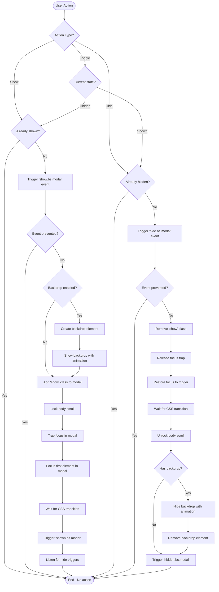
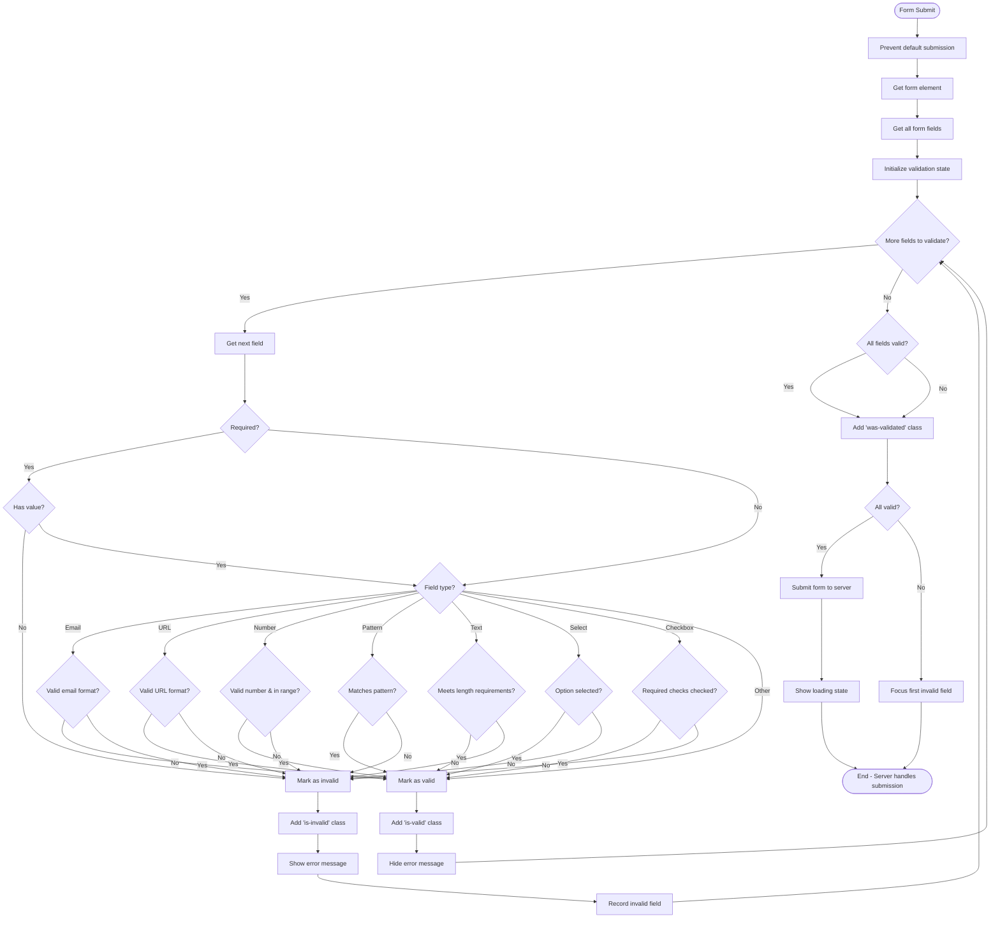
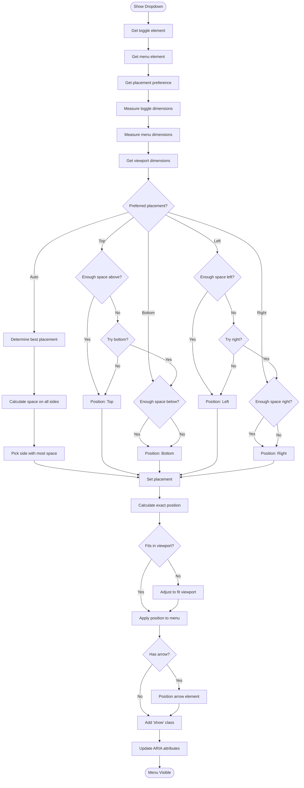
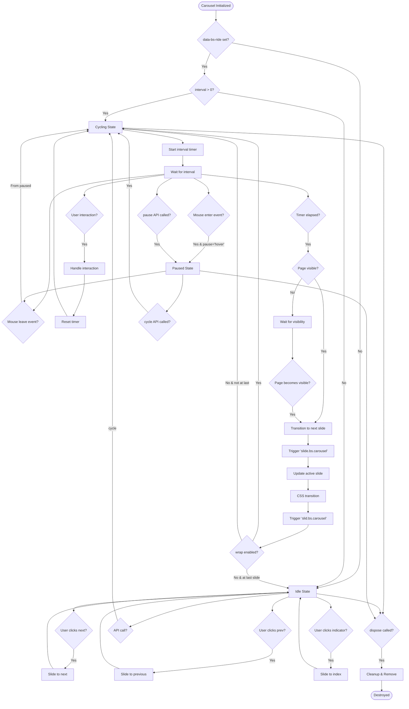
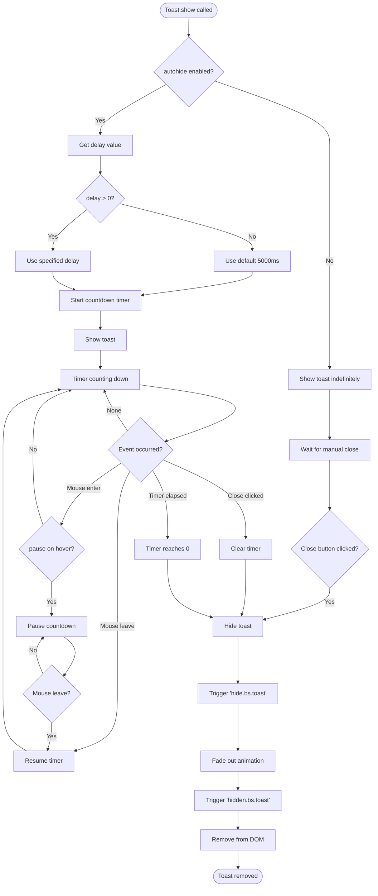
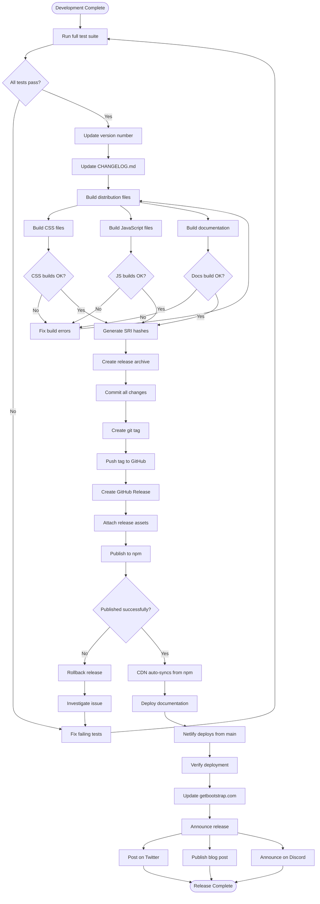
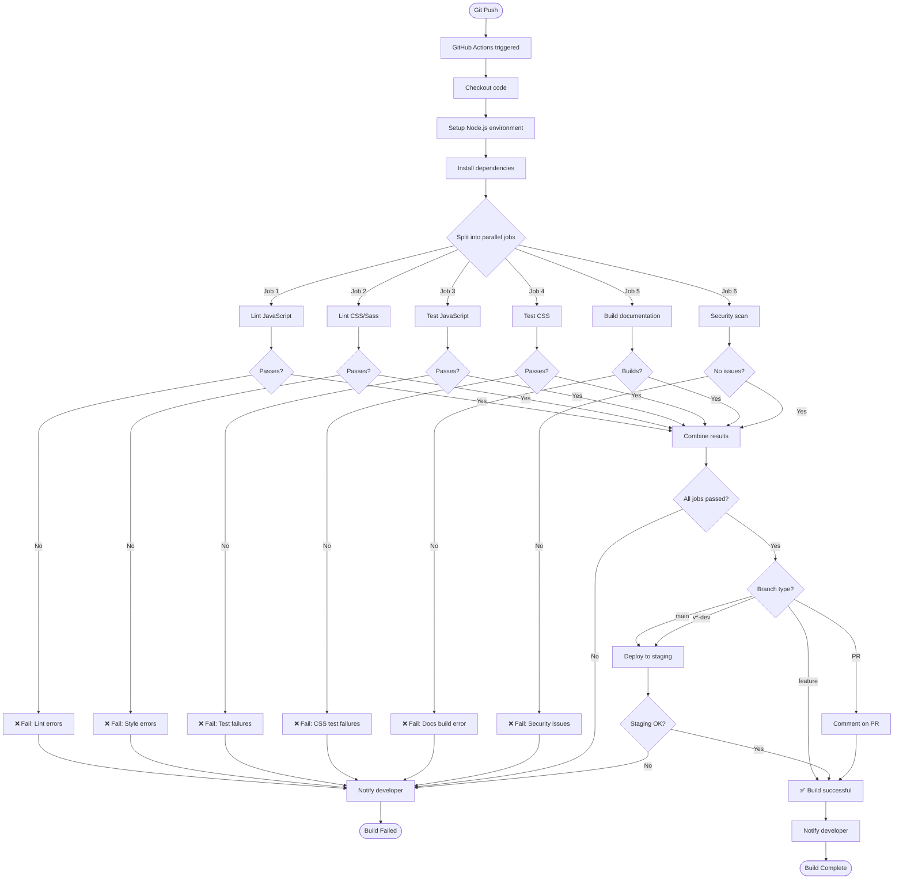

# Bootstrap Flow Diagrams

This document contains flowcharts showing application logic, decision trees, data transformation pipelines, and workflows within Bootstrap.

## Application Logic Flows

### 1. Component Initialization Flow

This flowchart shows how Bootstrap components are initialized from HTML.

```mermaid
flowchart TD
    Start([Page Load]) --> CheckDataAttr{Has data-bs-* attribute?}
    
    CheckDataAttr -->|Yes| GetComponentType[Get component type from data-bs-toggle]
    CheckDataAttr -->|No| CheckManual{Manual initialization?}
    
    GetComponentType --> ValidComponent{Valid component type?}
    
    ValidComponent -->|Yes| GetOptions[Get options from data-bs-* attributes]
    ValidComponent -->|No| End([End - No action])
    
    GetOptions --> CheckExisting{Instance already exists?}
    
    CheckExisting -->|Yes| UseExisting[Use existing instance]
    CheckExisting -->|No| CreateInstance[Create new instance]
    
    CreateInstance --> StoreInstance[Store in WeakMap]
    StoreInstance --> AttachEvents[Attach event listeners]
    UseExisting --> AttachEvents
    
    AttachEvents --> Ready([Component Ready])
    
    CheckManual -->|Yes| ManualInit[Call new bootstrap.Component()]
    CheckManual -->|No| End
    
    ManualInit --> ValidateElement{Element exists?}
    ValidateElement -->|Yes| CreateInstance
    ValidateElement -->|No| Error([Throw Error])
    
    Ready --> End
```

---

### 2. Modal Show/Hide Decision Tree

Decision flow for showing and hiding modals.



---

### 3. Form Validation Logic Flow

Client-side form validation decision flow.



---

### 4. Dropdown Positioning Algorithm

Flow for calculating dropdown menu position.



---

### 5. Carousel Cycling State Machine

State machine for carousel auto-cycling.



---

### 6. Toast Auto-Hide Timer Flow

Flow for toast auto-hide functionality.



---

## Data Transformation Pipelines

### 7. Sass Compilation Pipeline

Data flow for Sass to CSS compilation.

```mermaid
flowchart LR
    Input[SCSS Source Files] --> LoadVars[Load _variables.scss]
    
    LoadVars --> ParseVars[Parse Sass variables]
    ParseVars --> LoadFuncs[Load _functions.scss]
    LoadFuncs --> ProcessFuncs[Process Sass functions]
    
    ProcessFuncs --> LoadMixins[Load _mixins.scss]
    LoadMixins --> ProcessMixins[Process Sass mixins]
    
    ProcessMixins --> LoadComponents[Load component files]
    LoadComponents --> ProcessEach{For each component}
    
    ProcessEach -->|Process| ApplyVars[Apply variables]
    ApplyVars --> ApplyMixins[Apply mixins]
    ApplyMixins --> ExpandLoops[Expand @each loops]
    ExpandLoops --> CalcValues[Calculate functions]
    CalcValues --> GenerateCSS[Generate CSS rules]
    
    GenerateCSS --> CombineCSS[Combine all CSS]
    
    CombineCSS --> PostCSS[PostCSS Processing]
    PostCSS --> Autoprefixer[Add vendor prefixes]
    Autoprefixer --> RTL{Generate RTL?}
    
    RTL -->|Yes| RTLConvert[Convert to RTL]
    RTL -->|No| Optimize[Optimize CSS]
    
    RTLConvert --> Optimize
    
    Optimize --> Minify{Minify?}
    
    Minify -->|Yes| MinifyCSS[Minify with CleanCSS]
    Minify -->|No| Output
    
    MinifyCSS --> Output[Output CSS Files]
    
    Output --> bootstrap.css
    Output --> bootstrap.min.css
    Output --> bootstrap.rtl.css
    Output --> bootstrap.rtl.min.css
```



---

### 8. JavaScript Build Pipeline

Data flow for JavaScript compilation and bundling.

```mermaid
flowchart LR
    Input[ES6+ Source Files] --> ParseImports[Parse ES6 imports]
    
    ParseImports --> ResolveModules[Resolve module dependencies]
    ResolveModules --> BuildGraph[Build dependency graph]
    
    BuildGraph --> Rollup[Rollup Bundler]
    
    Rollup --> BundleType{Bundle type?}
    
    BundleType -->|Individual| IndividualFiles[Individual component files]
    BundleType -->|Bundle| CombineAll[Combine all components]
    BundleType -->|ESM| ESMFormat[ES Module format]
    
    IndividualFiles --> Transpile
    CombineAll --> IncludePopper{Include Popper.js?}
    ESMFormat --> Transpile
    
    IncludePopper -->|Yes| AddPopper[Bundle with Popper]
    IncludePopper -->|No| Transpile[Babel Transpilation]
    
    AddPopper --> Transpile
    
    Transpile --> ES5Output[ES5 Compatible Output]
    ES5Output --> SourceMaps{Generate source maps?}
    
    SourceMaps -->|Yes| CreateMaps[Create .map files]
    SourceMaps -->|No| Minify
    
    CreateMaps --> Minify{Minify?}
    
    Minify -->|Yes| Terser[Terser minification]
    Minify -->|No| Output
    
    Terser --> Comments[Preserve license comments]
    Comments --> Compress[Compress code]
    Compress --> Mangle[Mangle variable names]
    Mangle --> Output[Output JS Files]
    
    Output --> bootstrap.js
    Output --> bootstrap.min.js
    Output --> bootstrap.bundle.js
    Output --> bootstrap.bundle.min.js
    Output --> bootstrap.esm.js
```



---

## Deployment Workflows

### 9. Release Deployment Workflow

Complete release process from development to production.



---

### 10. CI/CD Pipeline Flow

Continuous integration and deployment flow.



---

*These flow diagrams illustrate the key processes and logic flows within Bootstrap. For interaction flows, see the Sequence Diagrams document.*
