# Bootstrap Sequence Diagrams

This document contains sequence diagrams showing the interaction flows for Bootstrap components and features.

## Component Interaction Flows

### 1. Modal Dialog Interaction Flow

This diagram shows the complete lifecycle of a modal dialog from user interaction to cleanup.

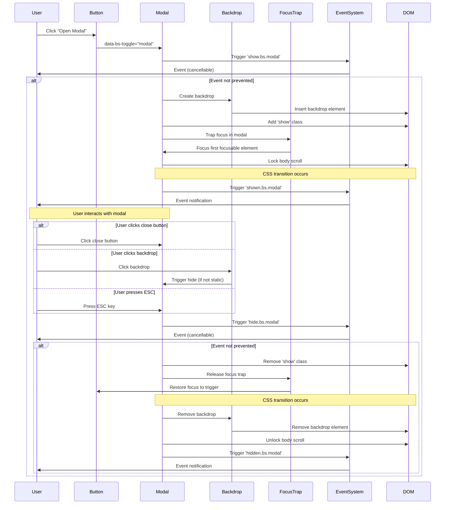

---

### 2. Dropdown Menu Interaction Flow

Shows how dropdown menus handle positioning and user interaction.

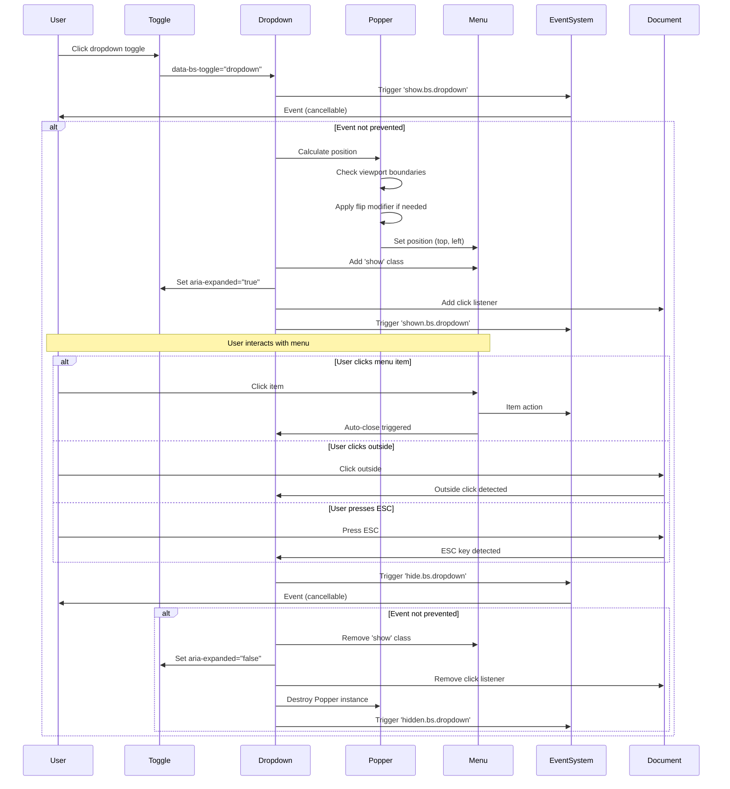

---

### 3. Carousel Auto-Cycle Flow

Demonstrates the carousel's automatic cycling mechanism.

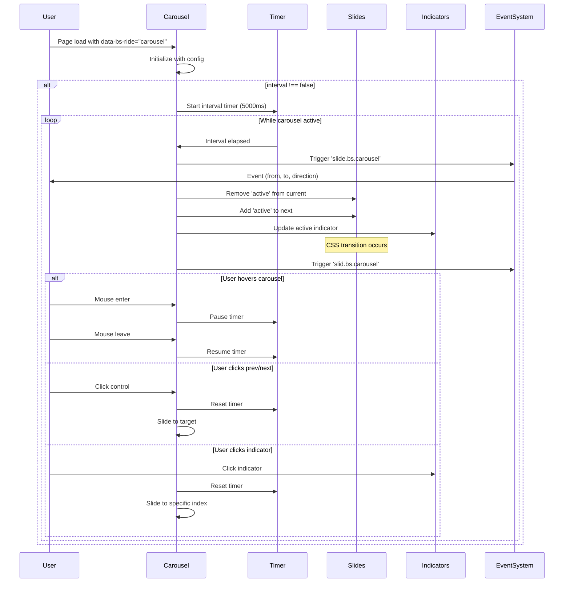

---

### 4. Form Validation Flow

Shows client-side form validation process.

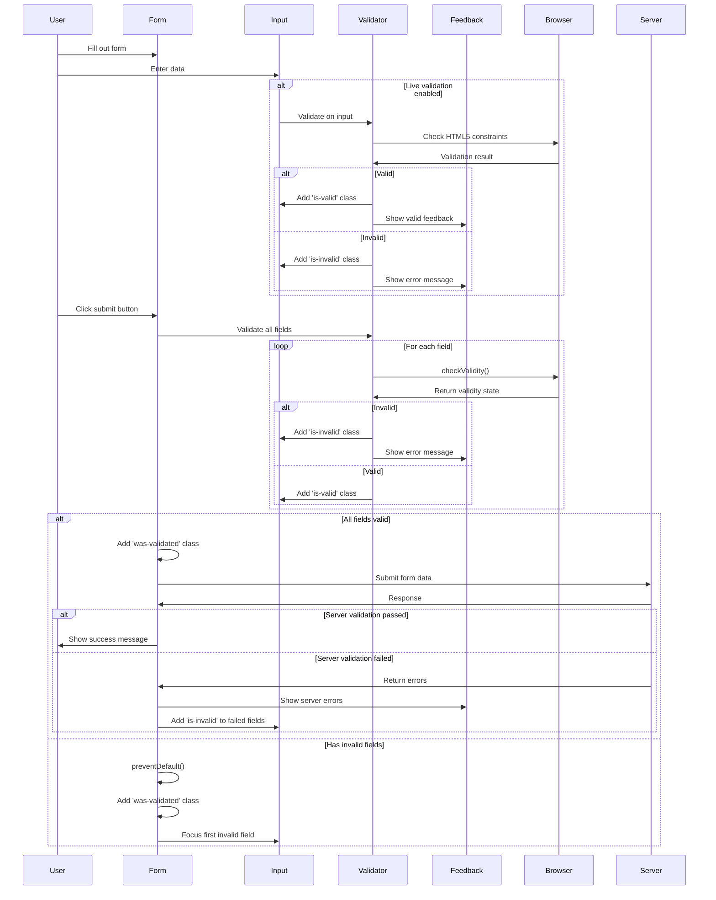

---

### 5. Toast Notification Flow

Demonstrates the toast notification lifecycle.

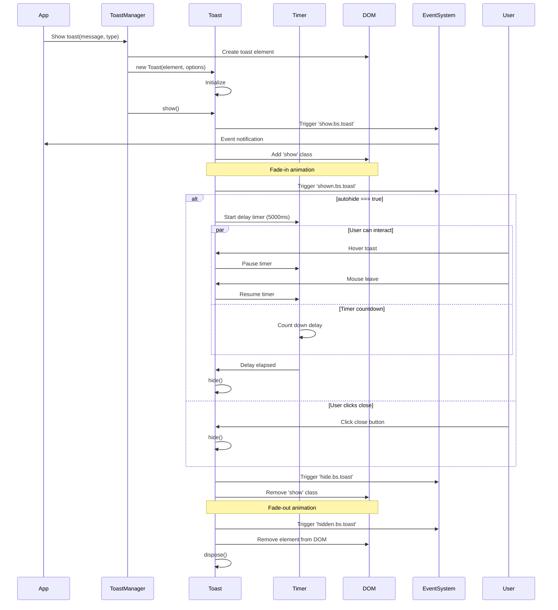

---

### 6. Tooltip/Popover Positioning Flow

Shows how tooltips and popovers are positioned intelligently.

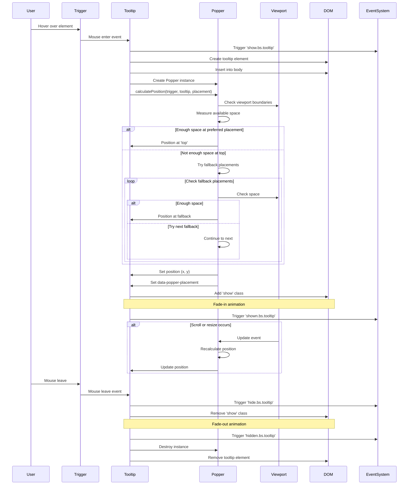

---

## Authentication and Authorization Sequences

### N/A for Bootstrap

Bootstrap is a front-end framework and does not handle authentication or authorization. These concerns are handled by your backend application. However, Bootstrap provides UI components that can be used in authentication flows:

**Example: Login Form Flow**

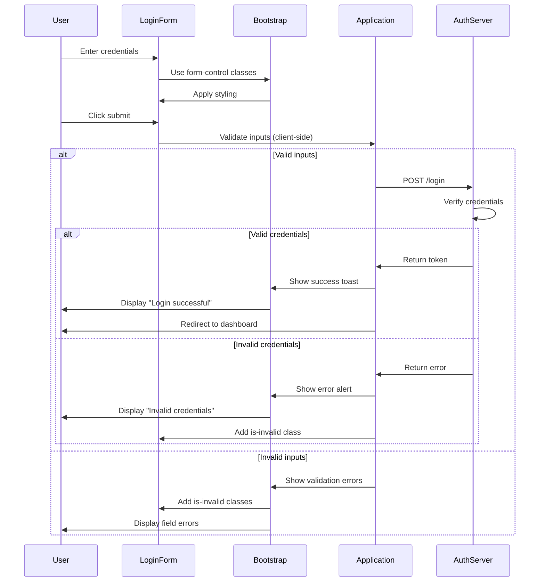

---

## Data Processing Pipelines

### Form Data Collection and Submission

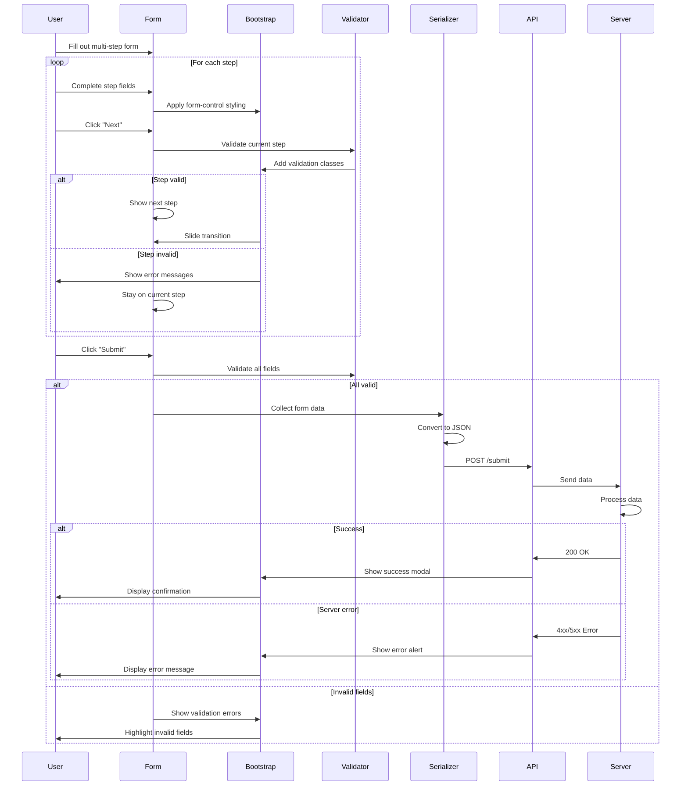

---

## Integration with External Services

### Loading External Data into Bootstrap Components

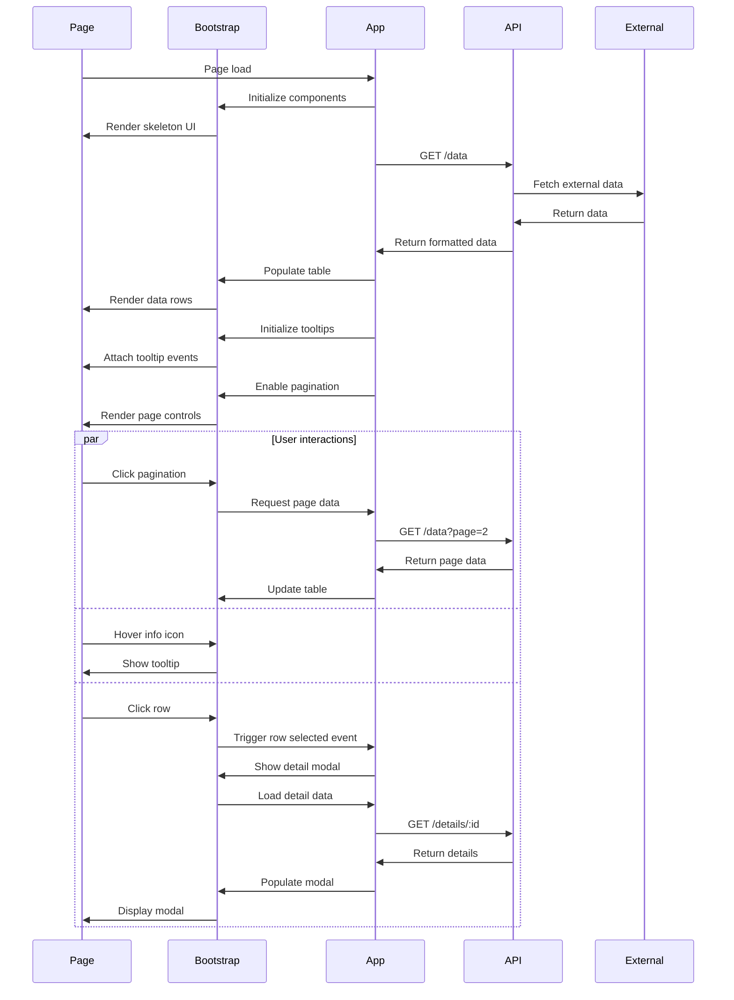

---

## Error Handling Flows

### Component Error Recovery

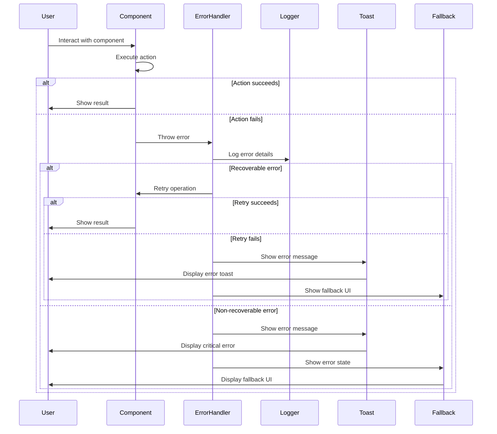

---

## Build and Deployment Flow

### Bootstrap Build Pipeline

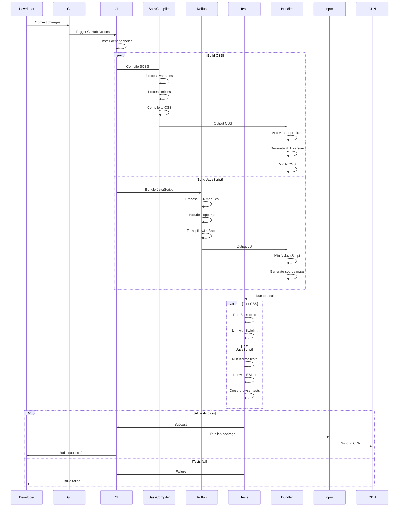

---

*These sequence diagrams illustrate the key interaction flows and processes within Bootstrap. For architectural overview, see the Architecture Diagrams document.*
