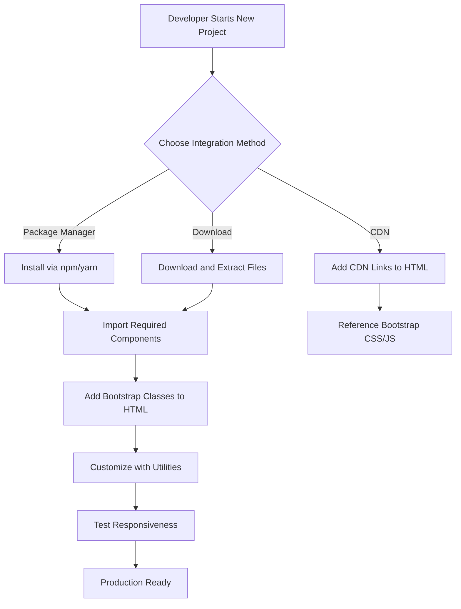
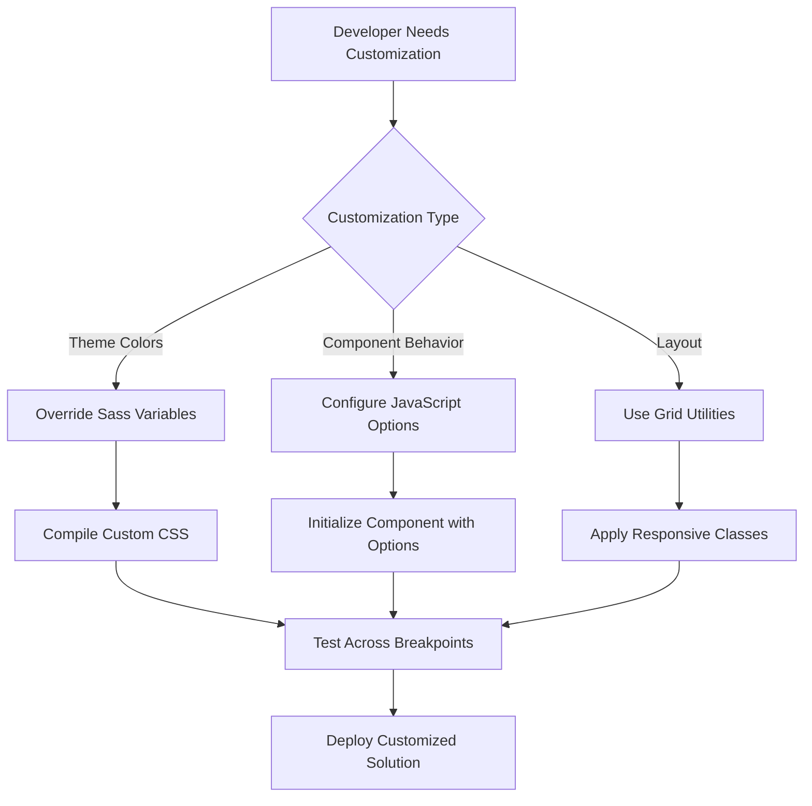
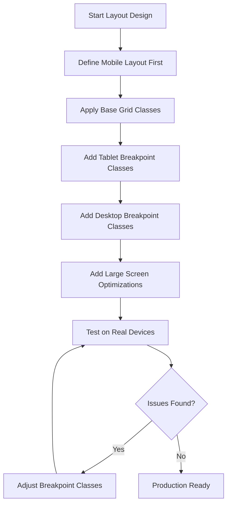
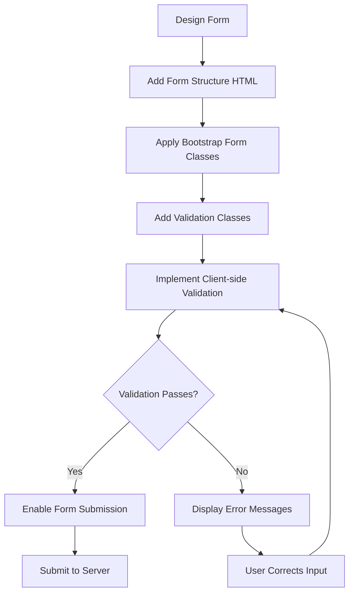
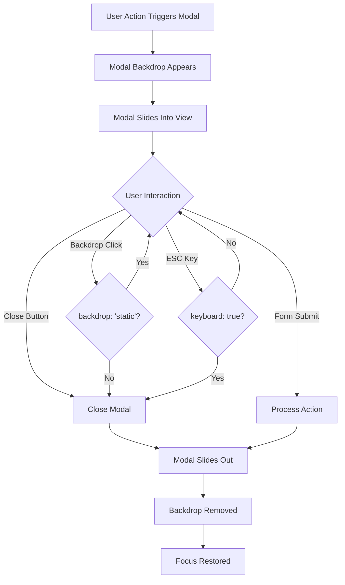
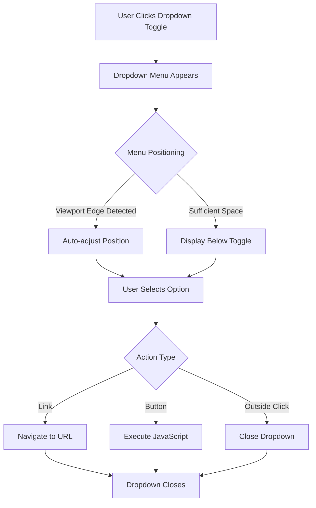
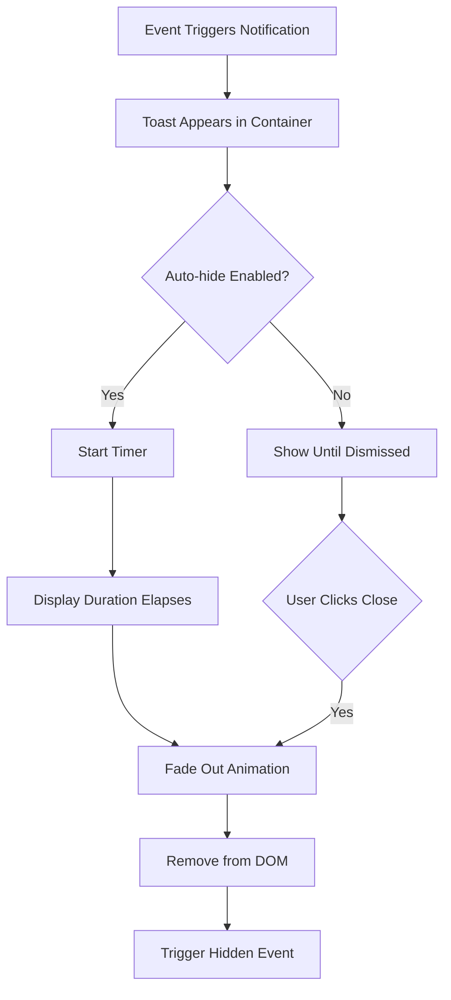
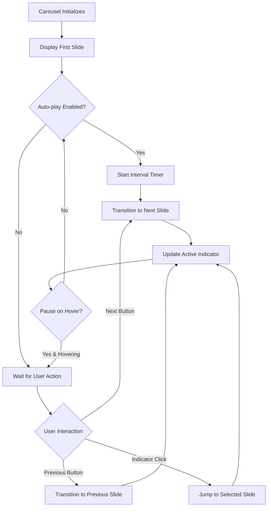

# Bootstrap Functional Flow Documentation

## Business Context and Objectives

### Purpose

Bootstrap serves as a comprehensive front-end framework designed to accelerate web development by providing:

1. **Rapid Prototyping**: Enable developers to quickly build responsive prototypes
2. **Consistent Design**: Ensure design consistency across web applications
3. **Cross-browser Compatibility**: Provide reliable components that work across all modern browsers
4. **Developer Productivity**: Reduce development time with pre-built, tested components
5. **Accessibility**: Ensure web applications are accessible to all users

### Target Users

- **Front-end Developers**: Building responsive web applications
- **UI/UX Designers**: Creating consistent user interfaces
- **Full-stack Developers**: Needing reliable frontend solutions
- **Startups and Enterprises**: Requiring rapid development capabilities
- **Open Source Projects**: Seeking a solid foundation for web projects

## Core Functional Flows

### 1. Component Integration Flow

#### User Journey: Integrating Bootstrap into a Project

**Business Rules:**
- Bootstrap can be integrated via multiple methods (CDN, npm, download)
- JavaScript components require Popper.js dependency for positioning
- CSS must be loaded before custom styles for proper cascade
- JavaScript should be loaded at end of body for optimal performance

### 2. Component Customization Flow

#### User Journey: Customizing Bootstrap Components

**Business Rules:**
- Sass variables must be set before importing Bootstrap
- JavaScript options can be passed via data attributes or JavaScript API
- Customizations should maintain accessibility standards
- Grid system follows mobile-first approach

### 3. Responsive Design Flow

#### User Journey: Building Responsive Layouts

**Business Rules:**
- Mobile-first approach: base styles for mobile, enhance for larger screens
- Breakpoints: xs (< 576px), sm (≥ 576px), md (≥ 768px), lg (≥ 992px), xl (≥ 1200px), xxl (≥ 1400px)
- Grid uses flexbox for flexible layouts
- Containers provide responsive max-widths

### 4. Form Handling Flow

#### User Journey: Creating Interactive Forms

**Business Rules:**
- Bootstrap provides visual validation states (valid, invalid)
- Validation can be triggered on submit or live during input
- Custom validation messages can be displayed
- Accessibility labels and ARIA attributes required

### 5. Modal Dialog Flow

#### User Journey: Implementing Modal Dialogs

**Business Rules:**
- Modals trap focus for accessibility
- Only one modal can be shown at a time
- Backdrop click behavior is configurable
- Escape key closes modal by default
- Scrolling is disabled on body when modal is open

### 6. Dropdown Menu Flow

#### User Journey: Interactive Dropdown Menus

**Business Rules:**
- Dropdowns use Popper.js for intelligent positioning
- Keyboard navigation supported (arrow keys, Enter, ESC)
- Auto-close on outside click by default
- Can be contained within navigation bars, button groups, etc.

### 7. Toast Notification Flow

#### User Journey: Displaying Toast Notifications

**Business Rules:**
- Toasts stack in a container (top-right by default)
- Auto-hide delay is configurable (default 5000ms)
- Toasts are non-blocking and dismissible
- Can contain actions and icons

### 8. Carousel/Slideshow Flow

#### User Journey: Implementing Image Carousels

**Business Rules:**
- Slides transition with fade or slide animation
- Keyboard controls enabled (left/right arrows)
- Touch swipe gestures supported on mobile
- Auto-play pauses on hover by default
- Indicators show current slide position

## Integration Points with Business Systems

### 1. Content Management Systems (CMS)

Bootstrap integrates with popular CMS platforms:
- **WordPress**: Via themes and plugins
- **Drupal**: Bootstrap-based themes
- **Joomla**: Bootstrap templates

### 2. JavaScript Frameworks

Bootstrap components work alongside:
- **React**: react-bootstrap library
- **Angular**: ng-bootstrap
- **Vue.js**: bootstrap-vue

### 3. Build Systems

Compatible with modern build tools:
- **Webpack**: Import individual components
- **Vite**: ESM support
- **Parcel**: Auto-bundling

### 4. Design Tools

Integrations with design platforms:
- **Figma**: Bootstrap UI kits
- **Sketch**: Component libraries
- **Adobe XD**: Design systems

## Business Rules and Logic

### Grid System Rules
1. Rows must be within containers
2. Columns must be within rows
3. Maximum 12 columns per row
4. Gutters provide spacing between columns
5. Offset classes available for positioning

### Component Interaction Rules
1. Components emit custom events for state changes
2. JavaScript API available for programmatic control
3. Data attributes provide declarative initialization
4. Components can be destroyed and re-initialized

### Responsive Behavior Rules
1. Mobile-first: base styles apply to all sizes, enhanced upward
2. Breakpoints cascade upward unless overridden
3. Hidden/visible utilities control element visibility by size
4. Order utilities change flex item order by breakpoint

### Accessibility Rules
1. Semantic HTML elements used where possible
2. ARIA attributes for complex widgets
3. Keyboard navigation for all interactive components
4. Focus indicators for keyboard users
5. Screen reader text for icon-only buttons

## Feature Dependencies and Interactions

### CSS Dependencies
- **Bootstrap CSS** → Required for all visual components
- **Grid System** → Foundation for layouts
- **Utilities** → Enhancement and customization layer

### JavaScript Dependencies
- **Popper.js** → Required for: Dropdowns, Popovers, Tooltips
- **Bootstrap JavaScript** → Required for: Modals, Carousels, Collapse, Tabs, Toasts
- **No dependencies** → Pure CSS: Alerts, Badges, Breadcrumbs, Buttons, Cards

### Component Interdependencies
- **Navbar** can contain: Dropdowns, Forms, Buttons
- **Cards** can contain: Any content, including other components
- **Modals** can contain: Forms, Carousels, any content
- **Dropdown** requires: Button or link trigger
- **Collapse** can be triggered by: Buttons, Links

## Validation Rules and Constraints

### Form Validation
- Client-side validation using HTML5 attributes
- Custom validation styles via `.is-valid` and `.is-invalid` classes
- Server-side validation can add validation classes dynamically
- Required fields indicated with `required` attribute

### Browser Constraints
- Internet Explorer 11 and below not supported
- JavaScript features require ES6+ browser support
- CSS Grid used for advanced layouts
- CSS Custom Properties for theming (fallbacks provided)

### Performance Constraints
- Recommended maximum of 5 active carousels per page
- Modal backdrop uses CSS for performance
- Transitions use CSS transforms for GPU acceleration
- Components lazy-initialize on first interaction

## Use Cases

### Use Case 1: Building a Landing Page
**Actor**: Front-end Developer  
**Goal**: Create a responsive marketing landing page  
**Steps**:
1. Set up Bootstrap via CDN or npm
2. Use grid system for layout structure
3. Add navbar with brand and navigation links
4. Create hero section with jumbotron styling
5. Add feature cards in grid layout
6. Implement contact form with validation
7. Add footer with links and social icons
8. Test responsiveness across breakpoints

### Use Case 2: Creating an Admin Dashboard
**Actor**: Full-stack Developer  
**Goal**: Build a data-rich admin interface  
**Steps**:
1. Install Bootstrap via package manager
2. Implement sidebar navigation with collapse
3. Create responsive data tables
4. Add modal dialogs for forms
5. Implement toast notifications for feedback
6. Use badge components for status indicators
7. Add charts with responsive containers
8. Implement breadcrumb navigation

### Use Case 3: Customizing Bootstrap Theme
**Actor**: UI/UX Designer  
**Goal**: Create branded theme matching company guidelines  
**Steps**:
1. Set up Sass compilation
2. Override primary color variables
3. Customize typography scale
4. Adjust spacing system
5. Modify border radius values
6. Compile custom Bootstrap CSS
7. Test components with new theme
8. Document custom variables

---

*This functional flow documentation provides a comprehensive overview of how Bootstrap components work together to create modern web applications.*
