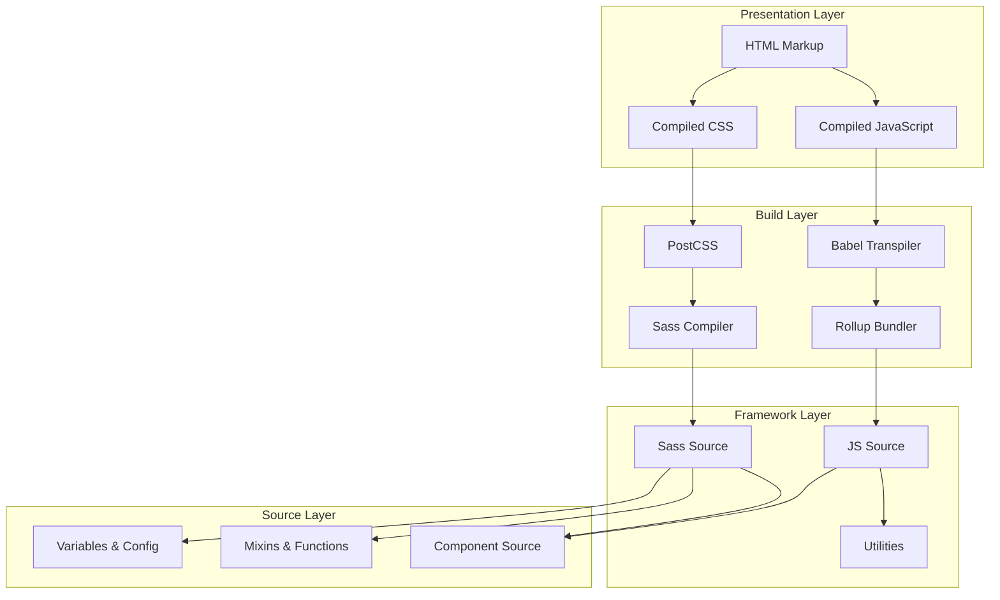
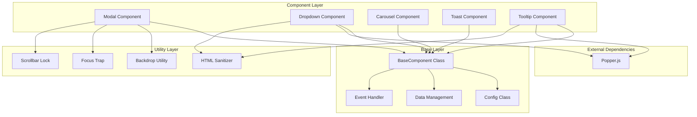
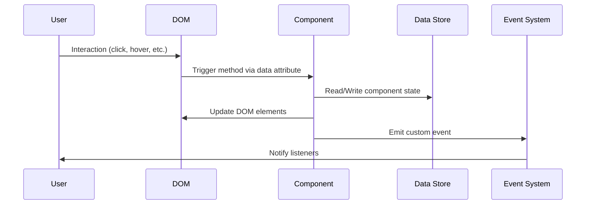
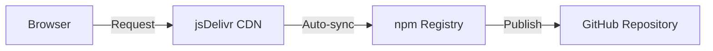
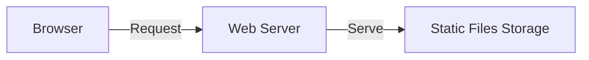
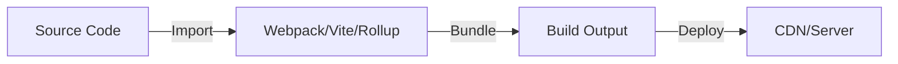
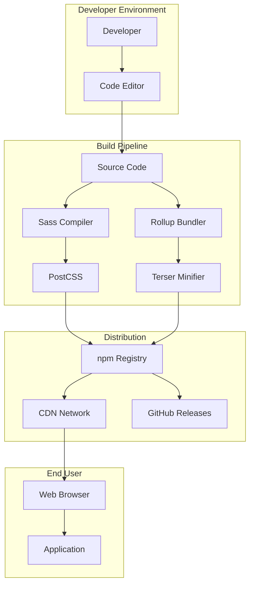

# Bootstrap Architect Guide

A comprehensive architectural overview for technical architects and system designers working with Bootstrap.

## Executive Summary

### System Purpose

Bootstrap is a comprehensive front-end framework designed to:

- **Accelerate Development**: Provide pre-built, tested components for rapid application development
- **Ensure Consistency**: Deliver a unified design language across applications
- **Enable Responsiveness**: Built mobile-first for all screen sizes
- **Promote Accessibility**: WCAG 2.1 compliant components with ARIA support
- **Support Customization**: Flexible Sass-based theming system

### Key Capabilities

1. **Responsive Grid System**: 12-column flexible layout system with 6 breakpoints
2. **Component Library**: 13+ JavaScript components, 40+ CSS components
3. **Utility Framework**: 200+ utility classes for rapid styling
4. **Theming System**: Comprehensive Sass variable system
5. **Dark Mode**: Built-in dark mode support
6. **RTL Support**: Right-to-left language support

### Technology Decisions

| Aspect | Decision | Rationale |
|--------|----------|-----------|
| **CSS Preprocessor** | Sass (SCSS) | Industry standard, powerful features, wide adoption |
| **JavaScript** | Vanilla ES6+ | No framework dependencies, lightweight, maximum compatibility |
| **Positioning** | Popper.js v2 | Best-in-class positioning library, battle-tested |
| **Build System** | Rollup + npm scripts | Efficient bundling, tree-shaking, simple configuration |
| **Testing** | Karma + Jasmine | Proven testing stack, cross-browser support |
| **Documentation** | Astro | Modern static site generator, fast performance |

---

## System Architecture

### Architectural Overview

Bootstrap follows a **layered architecture** with clear separation of concerns:



### Component Architecture

Bootstrap components follow a **modular architecture**:



### Data Architecture

#### Data Flow Pattern

Bootstrap uses a **unidirectional data flow** with event-driven updates:



#### State Management

Each component manages its own state:

```javascript
// Component state stored in WeakMap
const Data = {
  set(element, key, instance) {
    // Store instance data
  },
  get(element, key) {
    // Retrieve instance data
  },
  remove(element, key) {
    // Clean up instance data
  }
};
```

**Benefits:**
- No global state pollution
- Automatic garbage collection
- Memory efficient
- Multiple instances per page

---

## Design Decisions

### Architectural Patterns

#### 1. Mobile-First Responsive Design

**Decision**: All styles are written for mobile by default, then enhanced for larger screens.

**Rationale**:
- Mobile traffic dominates web usage (>60%)
- Progressive enhancement is more maintainable
- Smaller payload for mobile devices
- Forces focus on content hierarchy

**Implementation**:
```scss
// Base styles (mobile)
.element {
  width: 100%;
  padding: 1rem;
}

// Tablet and up
@include media-breakpoint-up(md) {
  .element {
    width: 50%;
    padding: 1.5rem;
  }
}

// Desktop and up
@include media-breakpoint-up(lg) {
  .element {
    width: 33.333%;
    padding: 2rem;
  }
}
```

#### 2. Component-Based Architecture

**Decision**: Each component is self-contained with its own HTML, CSS, and JavaScript.

**Rationale**:
- Improved maintainability
- Easier testing in isolation
- Better code reusability
- Clear dependencies

**Implementation**:
```
modal/
├── modal.scss       # Styles
├── modal.js         # Behavior
└── modal.html       # Structure (in docs)
```

#### 3. Utility-First CSS

**Decision**: Provide low-level utility classes alongside components.

**Rationale**:
- Rapid prototyping
- Reduces custom CSS
- Consistent spacing/sizing
- Smaller CSS footprint when used properly

**Trade-offs**:
- Can lead to verbose HTML
- Learning curve for naming
- **Mitigation**: Clear documentation, logical naming patterns

#### 4. No Framework Dependencies (JavaScript)

**Decision**: Use vanilla JavaScript instead of requiring jQuery or a framework.

**Rationale**:
- Smaller bundle size
- Better performance
- No version conflicts
- Future-proof

**Trade-offs**:
- More verbose code
- **Mitigation**: Internal utilities abstract common operations

#### 5. Sass-Based Theming

**Decision**: Use Sass variables and maps for all customization.

**Rationale**:
- Type-safe theming
- Compile-time optimizations
- Better IDE support
- Familiar to developers

**Trade-offs**:
- Requires build step
- Not runtime-customizable
- **Mitigation**: CSS custom properties for runtime themes (dark mode)

---

## Technology Choices

### CSS Architecture: Sass (SCSS)

**Why Sass?**

1. **Variables**: Define once, use everywhere
   ```scss
   $primary: #0074d9;
   $btn-primary-bg: $primary;
   ```

2. **Mixins**: Reusable style patterns
   ```scss
   @mixin button-variant($background, $border, $color) {
     background-color: $background;
     border-color: $border;
     color: $color;
   }
   ```

3. **Functions**: Calculate values
   ```scss
   @function tint-color($color, $weight) {
     @return mix(white, $color, $weight);
   }
   ```

4. **Maps**: Structured data
   ```scss
   $theme-colors: (
     "primary": $primary,
     "secondary": $secondary,
     "success": $success
   );
   ```

**Alternatives Considered**:
- **PostCSS**: Rejected - Less powerful preprocessing
- **Less**: Rejected - Smaller ecosystem, less features
- **Plain CSS**: Rejected - No compile-time optimizations

### JavaScript Architecture: ES6+ Modules

**Why Vanilla JavaScript?**

1. **Zero Dependencies**: No jQuery or framework required
2. **Modern Features**: Classes, modules, arrow functions
3. **Better Performance**: Direct DOM manipulation
4. **Tree-Shakable**: Import only what you need

**Module Pattern**:
```javascript
// Each component is an ES6 module
import BaseComponent from './base-component.js';
import EventHandler from './dom/event-handler.js';

class Modal extends BaseComponent {
  // Component implementation
}

export default Modal;
```

**Alternatives Considered**:
- **jQuery**: Rejected - Large dependency, declining usage
- **React**: Rejected - Framework lock-in
- **Web Components**: Rejected - Browser support gaps

### Positioning: Popper.js v2

**Why Popper.js?**

1. **Intelligent Positioning**: Auto-flips to stay in viewport
2. **Performance**: Virtual positioning, GPU-accelerated
3. **Flexibility**: Extensive configuration options
4. **Battle-Tested**: Used by millions of websites

**Usage**:
```javascript
import { createPopper } from '@popperjs/core';

const popper = createPopper(button, tooltip, {
  placement: 'top',
  modifiers: [
    {
      name: 'offset',
      options: { offset: [0, 8] }
    }
  ]
});
```

**Alternatives Considered**:
- **Custom Solution**: Rejected - Reinventing the wheel
- **Floating UI**: Considered for future versions

---

## Quality Attributes

### Performance

#### CSS Performance

**File Sizes (v5.3.8)**:
- `bootstrap.min.css`: ~24 KB gzipped
- `bootstrap.min.css` (full): ~175 KB uncompressed

**Optimizations**:
1. **Minification**: CSS minified with CleanCSS
2. **Compression**: Gzip/Brotli compression supported
3. **Tree-Shaking**: Import only needed components
4. **Critical CSS**: Inline critical styles

#### JavaScript Performance

**File Sizes (v5.3.8)**:
- `bootstrap.bundle.min.js`: ~28 KB gzipped
- `bootstrap.bundle.min.js` (full): ~77 KB uncompressed

**Optimizations**:
1. **Code Splitting**: Individual component files available
2. **Lazy Initialization**: Components initialize on first interaction
3. **Event Delegation**: Efficient event handling
4. **Debouncing**: Window events throttled

**Performance Benchmarks**:
- Modal open: < 16ms (1 frame @ 60fps)
- Dropdown position: < 8ms
- Carousel transition: GPU-accelerated CSS

### Scalability

#### Horizontal Scalability

Bootstrap scales across:
- **Small Projects**: Single landing page
- **Medium Projects**: Multi-page websites
- **Large Projects**: Enterprise applications
- **Very Large Projects**: Design systems for organizations

**Evidence**:
- Used by millions of websites
- Powers major enterprise applications
- Customizable at scale

#### Code Scalability

**Maintainability**:
- Modular architecture
- Clear naming conventions
- Comprehensive test coverage (>90%)
- Extensive documentation

**Extensibility**:
```scss
// Easy to extend with custom components
.my-custom-component {
  @extend .btn;
  background: $my-brand-color;
}
```

### Security

#### Built-in Security Features

1. **HTML Sanitization**
   ```javascript
   // Tooltips and popovers sanitize HTML content
   const tooltip = new bootstrap.Tooltip(element, {
     html: true,
     sanitize: true,  // Enabled by default
     title: ''  // Sanitized
   });
   ```

2. **XSS Prevention**
   - Template injection protected
   - Event handler XSS prevented
   - Data attribute injection sanitized

3. **Content Security Policy (CSP)**
   - No inline styles or scripts
   - No eval() usage
   - Nonce/hash compatible

#### Security Practices

- **Regular Security Audits**: Automated via CodeQL
- **Dependency Scanning**: Dependabot enabled
- **Responsible Disclosure**: Security policy defined
- **Quick Patching**: Security fixes prioritized

**Security Scorecard**: 8.2/10 (OpenSSF)

### Reliability

#### Cross-Browser Testing

**Supported Browsers**:
- Chrome/Edge (Chromium): Latest 2 versions
- Firefox: Latest 2 versions
- Safari: Latest 2 versions
- iOS Safari: Latest 2 versions
- Android Chrome: Latest 2 versions

**Testing Infrastructure**:
- BrowserStack for automated cross-browser testing
- 1000+ unit tests
- Visual regression testing

#### Error Handling

```javascript
// Graceful degradation
try {
  const modal = new bootstrap.Modal(element);
  modal.show();
} catch (error) {
  console.error('Modal initialization failed:', error);
  // Fallback behavior
}
```

#### Backwards Compatibility

- **Semantic Versioning**: Major.Minor.Patch
- **Migration Guides**: Between major versions
- **Deprecation Warnings**: Advanced notice of breaking changes

### Accessibility

#### WCAG 2.1 Level AA Compliance

**Features**:
1. **Keyboard Navigation**: All interactive components
2. **Screen Reader Support**: ARIA labels and live regions
3. **Focus Management**: Proper focus trapping and restoration
4. **Color Contrast**: Minimum 4.5:1 ratio
5. **Reduced Motion**: Respects `prefers-reduced-motion`

**Example - Modal Accessibility**:
```html
<div class="modal" tabindex="-1" role="dialog" aria-labelledby="modalTitle" aria-hidden="true">
  <div class="modal-dialog" role="document">
    <div class="modal-content">
      <div class="modal-header">
        <h5 class="modal-title" id="modalTitle">Accessible Modal</h5>
        <button type="button" class="btn-close" data-bs-dismiss="modal" aria-label="Close"></button>
      </div>
      <!-- ... -->
    </div>
  </div>
</div>
```

**Accessibility Testing**:
- Automated: aXe, WAVE, Lighthouse
- Manual: Screen reader testing (JAWS, NVDA, VoiceOver)
- Keyboard-only navigation testing

---

## Integration Strategy

### External Dependencies

#### Production Dependencies

```json
{
  "peerDependencies": {
    "@popperjs/core": "^2.11.8"
  }
}
```

**Rationale**: Popper.js only needed for positioning-dependent components (Dropdown, Tooltip, Popover)

#### Development Dependencies

Major categories:
- **Build Tools**: Rollup, Sass, PostCSS, Babel
- **Testing**: Karma, Jasmine, BrowserStack
- **Linting**: ESLint, Stylelint
- **Documentation**: Astro, MDX

### API Strategy

#### Public API

**JavaScript API**:
```javascript
// Constructor
const instance = new bootstrap.ComponentName(element, options);

// Static methods
bootstrap.ComponentName.getInstance(element);
bootstrap.ComponentName.getOrCreateInstance(element);

// Instance methods
instance.show();
instance.hide();
instance.toggle();
instance.dispose();

// Events
element.addEventListener('show.bs.componentName', handler);
element.addEventListener('shown.bs.componentName', handler);
element.addEventListener('hide.bs.componentName', handler);
element.addEventListener('hidden.bs.componentName', handler);
```

**CSS API**:
```html
<!-- Classes -->
<div class="component component-modifier component-lg">

<!-- Data attributes -->
<button data-bs-toggle="modal" data-bs-target="#myModal">

<!-- Utilities -->
<div class="d-flex justify-content-center align-items-center">
```

#### API Versioning

- **Major Version**: Breaking changes to API
- **Minor Version**: New features, backwards compatible
- **Patch Version**: Bug fixes only

**Deprecation Policy**:
1. Feature marked deprecated in version N
2. Deprecation warnings in console
3. Feature removed in version N+1 (next major)

### Communication Patterns

#### Event-Driven Architecture

Bootstrap components communicate via custom events:

```javascript
// Component emits events
const modalElement = document.getElementById('myModal');

// Listen for events
modalElement.addEventListener('show.bs.modal', function (event) {
  console.log('Modal is about to show');
  console.log('Triggered by:', event.relatedTarget);
  
  // Can prevent action
  if (someCondition) {
    event.preventDefault();
  }
});

// Events bubble up
document.addEventListener('show.bs.modal', function (event) {
  console.log('Any modal is about to show');
});
```

**Event Naming Convention**:
- Namespace: `.bs.{component}`
- Lifecycle: `show`, `shown`, `hide`, `hidden`
- Cancellable: Events before action (show, hide)
- Information: Events after action (shown, hidden)

---

## Deployment Architecture

### Deployment Models

#### 1. CDN Deployment (Recommended)



**Advantages**:
- Global edge network
- Automatic caching
- High availability
- Zero hosting cost

#### 2. Self-Hosted Deployment



**Advantages**:
- Full control
- No external dependencies
- Custom caching rules

#### 3. Build System Integration



**Advantages**:
- Tree-shaking (smaller bundles)
- Custom builds
- Framework integration

---

## Decision Records

### ADR-001: Migrate from jQuery to Vanilla JavaScript

**Status**: Accepted (v5.0.0)

**Context**: Bootstrap 4 required jQuery as a dependency. Modern browsers support the DOM API, making jQuery less necessary.

**Decision**: Remove jQuery dependency and rewrite all components in vanilla JavaScript.

**Consequences**:
- ✅ Smaller bundle size (~30% reduction)
- ✅ Better performance
- ✅ No version conflicts
- ❌ Breaking change for users expecting jQuery
- ❌ Migration effort for existing codebases

---

### ADR-002: Adopt Sass over Less

**Status**: Accepted (v4.0.0)

**Context**: Bootstrap 3 used Less. Sass gained significant market share and better features.

**Decision**: Migrate from Less to Sass (SCSS syntax).

**Consequences**:
- ✅ Better tooling and IDE support
- ✅ Larger ecosystem
- ✅ More powerful features (functions, advanced loops)
- ❌ Breaking change for theme authors
- ❌ Migration effort

---

### ADR-003: Use Popper.js for Positioning

**Status**: Accepted (v4.0.0, updated to v2 in v5.0.0)

**Context**: Custom positioning code was complex and hard to maintain.

**Decision**: Adopt Popper.js for dropdowns, tooltips, and popovers.

**Consequences**:
- ✅ Better positioning logic
- ✅ Automatic viewport boundary detection
- ✅ Maintained by external team
- ❌ Additional dependency
- ❌ Bundle size increase (~7KB)

---

### ADR-004: Support Dark Mode Natively

**Status**: Accepted (v5.3.0)

**Context**: Dark mode is increasingly popular. Users were creating custom dark themes.

**Decision**: Add built-in dark mode support using CSS custom properties and data attributes.

**Decision**: Implement dark mode using:
```html
<html data-bs-theme="dark">
```

**Consequences**:
- ✅ Native dark mode support
- ✅ Better user experience
- ✅ Respects OS preferences
- ❌ Slight complexity increase
- ❌ Requires modern browsers for CSS custom properties

---

## Architecture Diagrams

### High-Level System Diagram



---

*This architect guide provides a comprehensive architectural overview of Bootstrap. For implementation details, see the Developer Guide.*
